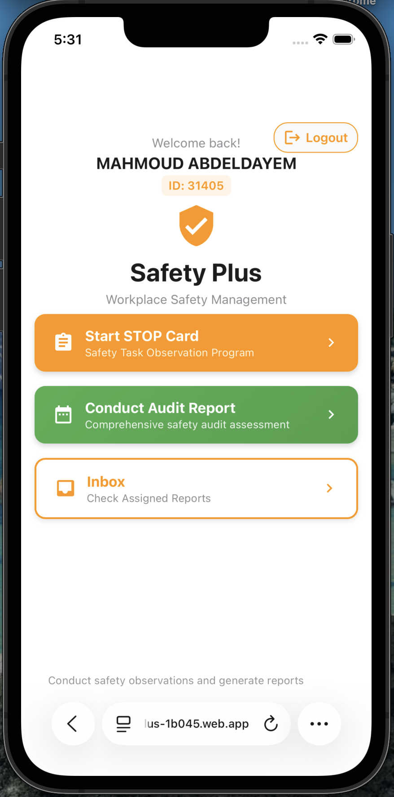

# SafetyPlus Web 

SafetyPlus is a workplace safety web app for creating, routing, and closing STOP Card and  audit reports. It captures observations, routes them to departments, tracks completion, mirrors data to Firestore, and can mirror selected events to Google Sheets.

## Overview
- STOP Card / audit report creation with images and validation
- Routing to departments and chiefs; reassignment, verification, and completion flows
- Firestore-backed storage plus optional Google Sheets mirroring via Apps Script
- Inbox/history views with counters, export options, and daily archive of completed reports

## Core Features
- Authentication via Firebase Authentication
- Audit/STOP report submission (text, categories, optional image upload)
- Department assignment, reassignment, accept/reject, and completion tracking
- Archival to `audit_reports_closed/{YYYY-MM-DD}` and completion counters per user
- Optional Google Sheets webhook (Apps Script) for new and completed reports

## Architecture
- React (Create React App) with React Router and Redux Toolkit
- Firebase Firestore for persistence; Cloudinary (optional) for image storage
- Google Apps Script endpoint (form-encoded POST) for mirroring to Sheets
- Docker configs for local/dev/prod (see `DOCKER.md`)

## Prerequisites
- Node.js 18+ and npm
- Firebase project (Firestore + Auth) with credentials
- (Optional) Google Apps Script Web App URL for Sheets mirroring

## Environment Variables
Create `.env` from your secrets. Common keys:

```
REACT_APP_FIREBASE_API_KEY=...
REACT_APP_FIREBASE_AUTH_DOMAIN=...
REACT_APP_FIREBASE_PROJECT_ID=...
REACT_APP_FIREBASE_STORAGE_BUCKET=...
REACT_APP_FIREBASE_MESSAGING_SENDER_ID=...
REACT_APP_FIREBASE_APP_ID=...
REACT_APP_AUDIT_GOOGLE_SHEETS_URL=https://script.google.com/macros/s/.../exec
```

## Setup
```bash
npm install
npm start
```
The dev server runs at http://localhost:3000.

## Scripts
- `npm start` – run locally in dev mode
- `npm test` – run tests
- `npm run build` – production build to `build/`
- `npm run eject` – CRA eject (one-way)

## Deployment
- Production build: `npm run build`
- Docker: see `docker-compose*.yml`, `Dockerfile`, `Dockerfile.dev`, and `DOCKER.md`

## Google Sheets Mirroring
- Client posts form-encoded payloads to the Apps Script URL in `REACT_APP_AUDIT_GOOGLE_SHEETS_URL`.
- Ensure the Web App is deployed with access that allows your frontend to POST (commonly "Anyone" for testing).
- The Apps Script should route `action=completed` rows to the `completed` sheet; other actions can go to `new`.

## Firebase Data Notes
- Active reports: `audit_reports/{reportId}`
- Daily archive: `audit_reports_closed/{YYYY-MM-DD}` with `reports` array
- Completion counters: `user_completion_stats/{userId}` with `completions_<year>` fields

## Screenshots

### Authentication & Home
<table>
  <tr>
    <td></td>
    <td></td>
    <td></td>
  </tr>
</table>

### Audit Report Creation & Details
<table>
  <tr>
    <td></td>
    <td></td>
    <td></td>
  </tr>
</table>

### STOP Card & Inbox
<table>
  <tr>
    <td></td>
    <td></td>
    <td></td>
  </tr>
  <tr>
    <td></td>
    <td></td>
    <td></td>
  </tr>
</table>

### Report Management & History
<table>
  <tr>
    <td></td>
    <td></td>
    <td></td>
  </tr>
  <tr>
    <td></td>
    <td></td>
    <td></td>
  </tr>
  <tr>
    <td></td>
    <td></td>
    <td></td>
  </tr>
</table>

Additional screenshots available in the `screenshoots/` folder.

## Support / Contributions
- Issues and feature requests: open an issue
- Contributions: fork, branch, PR with a short summary and testing notes
